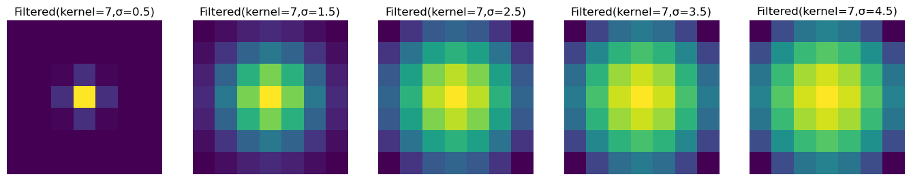
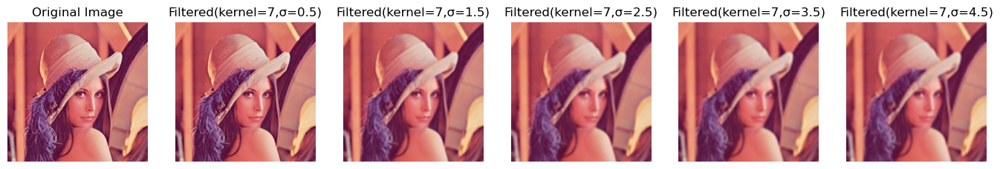
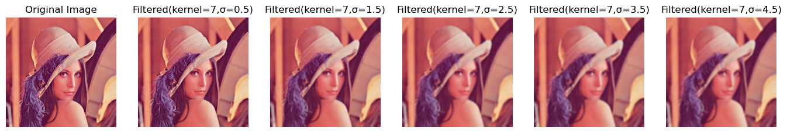
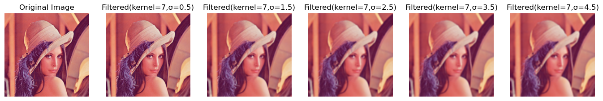

# Group 3
# Gaussian Averaging Filter with variable kernel size
The Gaussian smoothing operator is a 2-D convolution operator that is used to `blur' images and remove detail and noise. In this sense it is similar to the mean filter, but it uses a different kernel that represents the shape of a Gaussian (`bell-shaped') hump. This kernel has some special properties which are detailed below.

## How it Works
The Gaussian distribution in 1-D has the form:


where σ is the standard deviation of the distribution. We have also assumed that the distribution has a mean of zero (i.e. it is centered on the line x=0). The distribution is illustrated in the figure.


<p style="display: block;margin-left: auto;margin-right: auto;width: 50%;padding: 10">1-D Gaussian distribution with mean 0 and σ=1

In 2-D, an isotropic (i.e. circularly symmetric) Gaussian has the form:


This distribution is shown in the following figure.


<p style="display: block;margin-left: auto;margin-right: auto;width: 50%;padding: 10">2-D Gaussian distribution with mean (0,0) and σ=1

The idea of Gaussian smoothing is to use this 2-D distribution as a `point-spread' function, and this is achieved by convolution. Since the image is stored as a collection of discrete pixels we need to produce a discrete approximation to the Gaussian function before we can perform the convolution. In theory, the Gaussian distribution is non-zero everywhere, which would require an infinitely large convolution kernel, but in practice it is effectively zero more than about three standard deviations from the mean, and so we can truncate the kernel at this point. Figure below shows a suitable integer-valued convolution kernel that approximates a Gaussian with a σ of 1.0. It is not obvious how to pick the values of the mask to approximate a Gaussian. One could use the value of the Gaussian at the centre of a pixel in the mask, but this is not accurate because the value of the Gaussian varies non-linearly across the pixel. We integrated the value of the Gaussian over the whole pixel (by summing the Gaussian at 0.001 increments). The integrals are not integers: we rescaled the array so that the corners had the value 1. Finally, the 273 is the sum of all the values in the mask.


Once a suitable kernel has been calculated, then the Gaussian smoothing can be performed using standard convolution methods. The convolution can in fact be performed fairly quickly since the equation for the 2-D isotropic Gaussian shown above is separable into x and y components. Thus the 2-D convolution can be performed by first convolving with a 1-D Gaussian in the x direction, and then convolving with another 1-D Gaussian in the y direction. (The Gaussian is in fact the only completely circularly symmetric operator which can be decomposed in such a way.)

## Kernel Size and Sigma (σ)



As we can see in the image the kernel size dictates the area of the image we will work on at a single time and sigma controls the spread of the gaussian function. The larger the value of sigma the greater the area the gaussian function covers. We have values like amplitude that control the intensity or brightness of the pixel but it is usually normallized as 1. 

## Implementation
We have implemented three versions of the algorithm. The first one is a basic implementation using nested loops, the second one using numpy for finer control of the kernel creation and faster matrix calculations, and the last one is using the "scipy" library's convolve2d function for faster operations. But first the library version from openCV

```python
import PIL
import cv2

k = 7
sigma = 1.5

image = PIL.Image.open("../images/Lenna.png")
blurred_image = cv2.GaussianBlur(np.array(image), (k, k), sigmaX=sigma,borderType=cv2.BORDER_DEFAULT)
```


### Basic Implementation using nested loops
The basic implementation takes kernel_size,sigma and an image as arguments and returns the filtered image.

First we prepare a kernel using the kernel size specified and the value for sigma.
### Creating a kernel for smoothing
```python
def create_gaussian_kernel(size, sigma):
    """
    Create a 2D Gaussian kernel.
    """
    if size % 2 == 0:
        raise ValueError("Kernel size must be odd")
        
    kernel = []
    center = size // 2
    sum_values = 0
    
    for i in range(size):
        row = []
        for j in range(size):
            x = i - center
            y = j - center
            exponent = -(x*x + y*y)/(2*sigma*sigma)
            value = np.exp(exponent)
            row.append(value)
            sum_values += value
        kernel.append(row)
    
    # Normalize the kernel
    for i in range(size):
        for j in range(size):
            kernel[i][j] /= sum_values
            
    return kernel
```

```python
def apply_gaussian_filter(image, kernel_size, sigma):
    """
    Apply Gaussian filter to an image.
    Works with both grayscale and RGB images.
    """
    if not isinstance(image, np.ndarray):
        image = np.array(image)
    
    # Handle both RGB and grayscale images
    if len(image.shape) == 3:
        height, width, channels = image.shape
        output = np.zeros((height, width, channels))
        
        # Process each color channel separately
        for c in range(channels):
            kernel = create_gaussian_kernel(kernel_size, sigma)
            padding = 0
            
            # Apply convolution to each channel
            for i in range(height):
                for j in range(width):
                    sum_value = 0
                    for ki in range(kernel_size):
                        for kj in range(kernel_size):
                            im_i = i + ki - padding
                            im_j = j + kj - padding
                            
                            # Handle boundaries by mirroring
                            if im_i < 0:
                                im_i = abs(im_i)
                            elif im_i >= height:
                                im_i = 2*height - im_i - 2
                                
                            if im_j < 0:
                                im_j = abs(im_j)
                            elif im_j >= width:
                                im_j = 2*width - im_j - 2
                            
                            sum_value += image[im_i][im_j][c] * kernel[ki][kj]
                    
                    output[i, j, c] = sum_value
    else:
        # Grayscale image processing
        height, width = image.shape
        output = np.zeros((height, width))
        kernel = create_gaussian_kernel(kernel_size, sigma)
        padding = kernel_size // 2
        
        for i in range(height):
            for j in range(width):
                sum_value = 0
                for ki in range(kernel_size):
                    for kj in range(kernel_size):
                        im_i = i + ki - padding
                        im_j = j + kj - padding
                        
                        if im_i < 0:
                            im_i = abs(im_i)
                        elif im_i >= height:
                            im_i = 2*height - im_i - 2
                            
                        if im_j < 0:
                            im_j = abs(im_j)
                        elif im_j >= width:
                            im_j = 2*width - im_j - 2
                        
                        sum_value += image[im_i][im_j] * kernel[ki][kj]
                
                output[i, j] = sum_value
    
    return output
```
Although this method works, it takes too long and doesn't scale up well for larger resolutions. That's why to make it faster we used numpy.

### Basic Implementation with Numpy
This takes the same arguements as the previous implementation but it uses numpy functions for faster and well scaling code.

```python
def create_gaussian_kernel(size, sigma):
    """
    Create a 2D Gaussian kernel that matches library implementations.
    """
    if size % 2 == 0:
        raise ValueError("Kernel size must be odd")
    
    # Create a coordinate grid centered at 0
    ax = np.linspace(-(size - 1) / 2., (size - 1) / 2., size)
    xx, yy = np.meshgrid(ax, ax)
    
    # Calculate the kernel using the correct 2D Gaussian formula
    kernel = np.exp(-(xx**2 + yy**2) / (2. * sigma**2))
    
    # Normalize the kernel to sum to 1
    kernel = kernel / kernel.sum()
    
    return kernel

def apply_gaussian_filter(image, kernel_size, sigma):
    """
    Apply Gaussian filter to an image with correct boundary handling.
    Works with both grayscale and RGB images.
    """
    if not isinstance(image, np.ndarray):
        image = np.array(image)
    
    kernel = create_gaussian_kernel(kernel_size, sigma)
    padding = kernel_size // 2
    
    # Handle both RGB and grayscale images
    if len(image.shape) == 3:
        height, width, channels = image.shape
        output = np.zeros_like(image, dtype=np.float32)
        
        # Process each color channel separately
        for c in range(channels):
            padded = np.pad(image[:,:,c], padding, mode='reflect')
            
            # Apply convolution using numpy operations
            for i in range(height):
                for j in range(width):
                    window = padded[i:i+kernel_size, j:j+kernel_size]
                    output[i,j,c] = np.sum(window * kernel)
    else:
        height, width = image.shape
        output = np.zeros_like(image, dtype=np.float32)
        padded = np.pad(image, padding, mode='reflect')
        
        # Apply convolution
        for i in range(height):
            for j in range(width):
                window = padded[i:i+kernel_size, j:j+kernel_size]
                output[i,j] = np.sum(window * kernel)
    
    return output

```

This code performs much better than the basic implementation. It performs a bit better in speed and much better in memory consumption. But, it is still not the fastest way to implement it. Sure we can use the built in "correlate" function to speed it more but "Scipy" has a convolution function which is way faster.

### Gaussian Filter with Convolve2d
This is the fastest and comparable in performance to the library versions. Creating the kernel is the same as the previous implementation.

```python
def apply_gaussian_filter_fast(image, kernel_size, sigma):
    """
    Apply Gaussian filter using scipy's convolve2d for faster processing.
    """
    kernel = create_gaussian_kernel_fast(kernel_size, sigma)
    
    if len(image.shape) == 3:
        # Process each channel separately using list comprehension
        return np.stack([convolve2d(image[:,:,i], kernel, mode='same', boundary='symm')
                        for i in range(image.shape[2])], axis=2)
    else:
        return convolve2d(image, kernel, mode='same', boundary='symm')

```

## Results 
All implementations have identical results when run on a sample image [Lenna.png](images/Lenna.png).

**Reference Library**


**Basic Implementation with Nested Loops**


**Basic Implementation with Numpy**


**Gaussian Filter with Convolve2d**


## Performance
The performance of the implementations according to time elapsed and memory consumed. Four images of different resolutions where used to test the performance.

| Resolution | Implementation | Time Elapsed (S) | Memory Consumed (MB) |
|------------|----------------|--------------|-----------------|
| SD         | Reference      | 3.4750211238861084 | 177.38671875 |
|            | Basic with Nested Loops | 7.099121570587158 | 179.8828125 |
|            | Basic with Numpy | 2.8488917350769043 | 178.63671875 |
|            | Gaussian Filter with Convolve2d | 2.6308703422546387 | 181.95703125 |
| HD        | Reference      | 3.4686717987060547 | 346.875 |
|            | Basic with Nested Loops | 150.3326132297516 | 389.09375 |
|            | Basic with Numpy | 45.59813570976257 | 363.3046875 |
|            | Gaussian Filter with Convolve2d | 1.2301788330078125 | 398.4609375 |
| FHD         | Reference      | 3.4477434158325195 | 372.51953125 |
|            | Basic with Nested Loops | 226.56371474266052 | 435.796875 |
|            | Basic with Numpy | 68.18639135360718 | 397.140625 |
|            | Gaussian Filter with Convolve2d | 1.467437744140625 | 458.07421875 |
| 4k         | Reference      | 3.4825439453125 | 680.125 |
|            | Basic with Nested Loops | 1226.1059057712555 | 947.30078125 |
|            | Basic with Numpy | 363.11138105392456 | 653.58984375 |
|            | Gaussian Filter with Convolve2d | 4.297711372375488 | 1319.86328125 |

## Conclusion
According to the metrics used to test the implementations: Gaussian filter using the scipy convolve2d function performs way faster compared to the other manual implementations. But, it consumes higher amount of memory apart from the basic implementation with nested loops. If a little more work is done, it could be adapted maybe with parallel processing to use less memory while being faster to rival the built-in function from opencv. 

## Sources
* [Gaussian Smoothing](https://homepages.inf.ed.ac.uk/rbf/HIPR2/gsmooth.htm)
* [Computer Vision (Part 25)-Gaussian Filter](https://medium.com/@Coursesteach/computer-vision-part-25-gaussian-filter-c81ea05a4630)
* [Apply a Gauss filter to an image with Python](https://www.geeksforgeeks.org/apply-a-gauss-filter-to-an-image-with-python/)


