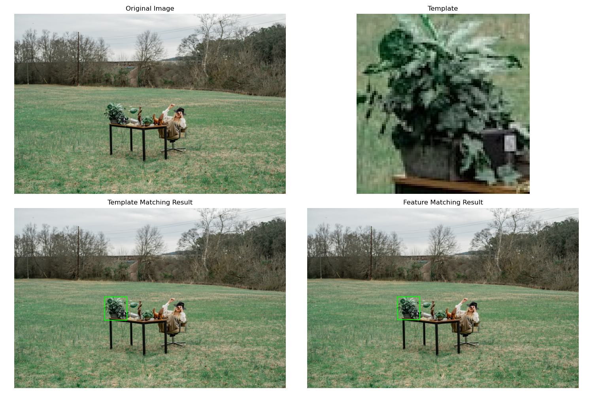
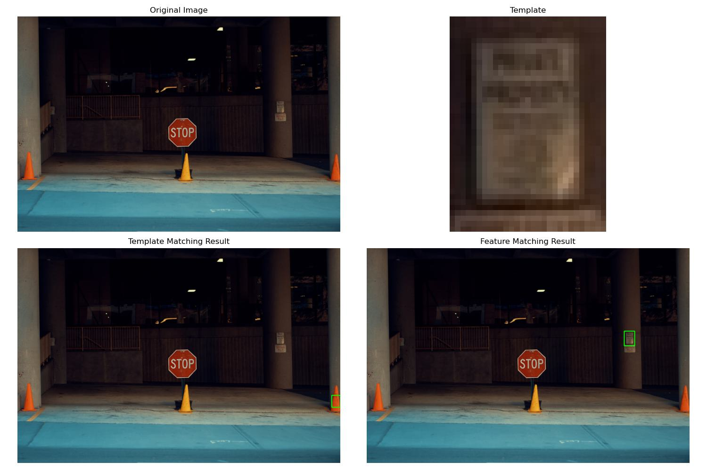
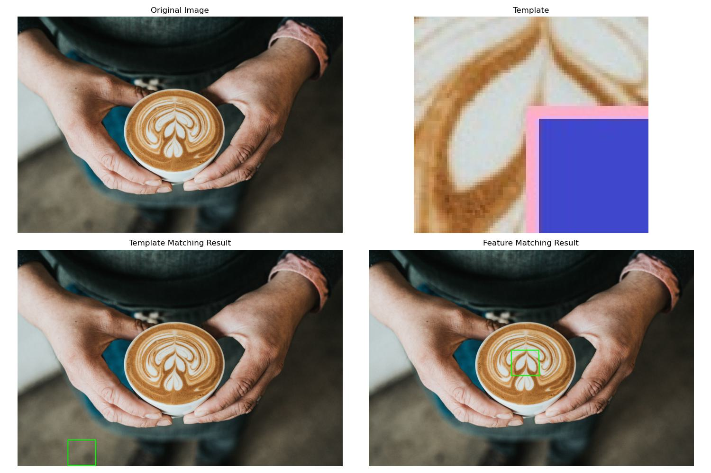
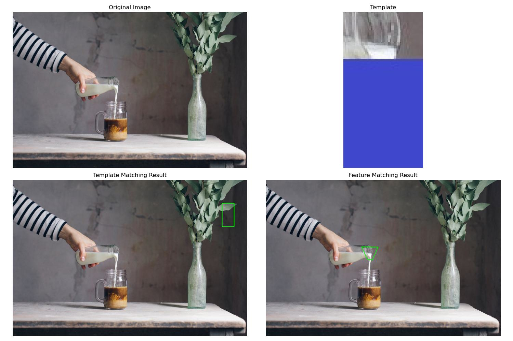
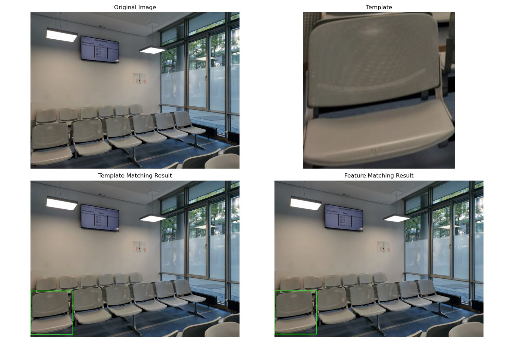
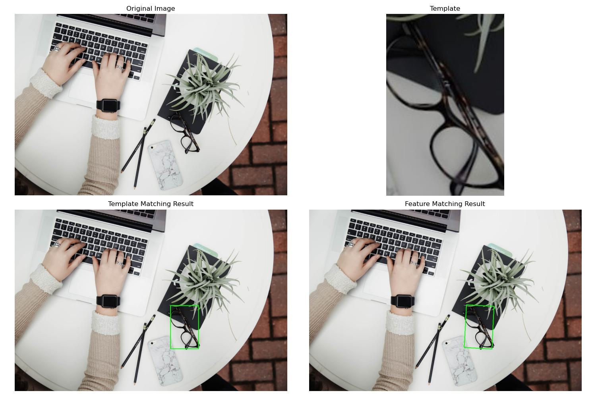

# Image Matching Implementation Report by Group 3

## 1. Theoretical Basis

Image matching in computer vision refers to the process of finding correspondences between different images or parts of images. This can involve identifying objects, features, or patterns in one image that are similar to those in another image.

The goal is to establish relationships between different images or parts of images, which can be used for tasks such as object recognition, image registration, and augmented reality.

### 1.1 Template Matching
Template matching is a technique used in image processing and computer vision to find a template image within a larger image. It involves sliding the template image over the larger image and comparing their pixel values or features to find the best match. Here's how it works in detail:

* Input Images: You have a template image and a larger image within which you want to find occurrences of the template.
* Sliding Window: The template image is moved (or "slid") over the larger image in a systematic way, usually pixel by pixel or in larger strides.
* Comparison: At each position of the template, a similarity measure is computed between the template and the corresponding region in the larger image. This measure can be based on pixel-wise differences, correlation coefficients, or other metrics depending on the application.
* Best Match: The position with the highest similarity measure indicates the best match of the template within the larger image.

OpenCV provides matchTemplate() function for template matching. There are the different comparison methods used in template matching. Each method has its own way of computing the similarity between the template and the target image. These are following:

* TM_CCOEFF: This method computes the correlation coefficient between the template and the target images.
* TM_CCOEFF_NORMED: This method computes the normalized correlation coefficient.
* TM_CCORR: It calculates the cross-correlation between the template and the image. 
* TM_CCORR_NORMED: Similar to TM_CCORR but normalized.
* TM_SQDIFF: This method computes the sum of squared differences between the template and the target images. 
* TM_SQDIFF_NORMED: This method computes the normalized sum of squared differences between the template and the target images. 

One practical example of using template matching in image processing is in automated quality control in manufacturing. Let's consider a scenario where you have a production line manufacturing circuit boards. Each board should have a specific configuration of components placed accurately on it. However, due to various reasons such as machine error or component defects, sometimes these components might be misplaced or missing. Template matching can be used to detect these defects. Here's how it works:

* Template Creation: First, you create a template image that represents the correct configuration of components on the circuit board. This template could be a high-resolution image of an ideal circuit board.
* Image Acquisition: As each circuit board moves along the production line, a camera takes an image of it.
* Template Matching: The acquired image is then compared with the template using template matching algorithms. 
* Defect Detection: If the similarity score falls below a certain threshold, it indicates that the components on the circuit board are not in the correct position or are missing. This alerts the system to a potential defect, and appropriate action can be taken, such as marking the defective board for manual inspection or rejection.

### 1.2 Feature-Based Matching (SIFT)
This method involves identifying distinctive features (such as corners, edges, or blobs) in the images and matching them based on their descriptors. Some common and popular algorithms used for feature-based matching include SIFT (Scale-Invariant Feature Transform), SURF (Speeded-Up Robust Features),  ORB (Oriented FAST and Rotated BRIEF), AKAZE (Accelerated-KAZE),  BRISK (Binary Robust Invariant Scalable Keypoints), and FREAK (Fast Retina Keypoint). 

Feature based matching involves following two important steps.

* Detect keypoints and descriptors: Detect distinctive points or regions in both images that are likely to be matched and extract numerical descriptors or feature vectors around each keypoint to describe its local neighborhood. These descriptors should be distinctive and invariant to changes in scale, rotation, and illumination. Algorithms such as SIFT used for this process.
* Match keypoints: Compare the descriptors of keypoints between the two images to find correspondences. We may apply filtering techniques to remove incorrect matches and retain only reliable correspondences. Different feature matcher such as Brute-Force matcher, FLANN matcher are used for this process.

## 2. System Description

### 2.1 Architecture
The system consists of three main components:

1. Image Matcher Class [image_matcher.py](source/image_matcher.py)
2. Test Framework [test_matcher.py](source/test_matcher.py)
3. Test Image Generator [download_test_images.py](source/download_test_images.py)

### 2.2 Algorithms
#### Template Matching Implementation: 
```python
def template_matching(self, image, template):
        """
        Perform template matching using cv2.matchTemplate
        """
        # Convert images to grayscale
        img_gray = cv2.cvtColor(image, cv2.COLOR_BGR2GRAY)
        template_gray = cv2.cvtColor(template, cv2.COLOR_BGR2GRAY)
        
        # Apply template matching
        result = cv2.matchTemplate(img_gray, template_gray, cv2.TM_CCOEFF_NORMED)
        
        # Get the best match location
        min_val, max_val, min_loc, max_loc = cv2.minMaxLoc(result)
        
        # Get template dimensions
        h, w = template.shape[:2]
        
        # Define the rectangle corners
        top_left = max_loc
        bottom_right = (top_left[0] + w, top_left[1] + h)
        
        # Calculate metrics
        execution_time = time.time() - start_time
        confidence = max_val
        
        self.metrics['template'] = {
            'execution_time': execution_time,
            'confidence': confidence,
            'method': 'Template Matching'
        }
        
        return [(top_left, bottom_right)], confidence
```

#### Feature Matching Implementation:
```python
def feature_matching(self, image, template):
        """
        Perform feature matching using SIFT
        """
        start_time = time.time()
        
        # Convert images to grayscale
        img_gray = cv2.cvtColor(image, cv2.COLOR_BGR2GRAY)
        template_gray = cv2.cvtColor(template, cv2.COLOR_BGR2GRAY)
        
        # Find keypoints and descriptors
        kp1, des1 = self.sift.detectAndCompute(template_gray, None)
        kp2, des2 = self.sift.detectAndCompute(img_gray, None)
        
        # Store number of keypoints
        num_keypoints_template = len(kp1)
        num_keypoints_image = len(kp2)
        
        # FLANN parameters and matcher
        FLANN_INDEX_KDTREE = 1
        index_params = dict(algorithm=FLANN_INDEX_KDTREE, trees=5)
        search_params = dict(checks=50)
        flann = cv2.FlannBasedMatcher(index_params, search_params)
        
        matches = flann.knnMatch(des1, des2, k=2)
        
        # Apply Lowe's ratio test
        good_matches = []
        for m, n in matches:
            if m.distance < 0.7 * n.distance:
                good_matches.append(m)
        
        match_ratio = len(good_matches) / len(matches) if matches else 0
        
        if len(good_matches) >= 4:
            src_pts = np.float32([kp1[m.queryIdx].pt for m in good_matches]).reshape(-1, 1, 2)
            dst_pts = np.float32([kp2[m.trainIdx].pt for m in good_matches]).reshape(-1, 1, 2)
            
            # Find homography
            H, mask = cv2.findHomography(src_pts, dst_pts, cv2.RANSAC, 5.0)
            
            if H is not None:
                h, w = template_gray.shape
                pts = np.float32([[0, 0], [0, h-1], [w-1, h-1], [w-1, 0]]).reshape(-1, 1, 2)
                dst = cv2.perspectiveTransform(pts, H)
                
                # Convert to list of corner points
                corners = [(tuple(map(int, corner[0]))) for corner in dst]
                
                # Calculate metrics
                execution_time = time.time() - start_time
                inlier_ratio = np.sum(mask) / len(mask) if len(mask) > 0 else 0
                
                self.metrics['feature'] = {
                    'execution_time': execution_time,
                    'num_keypoints_template': num_keypoints_template,
                    'num_keypoints_image': num_keypoints_image,
                    'num_good_matches': len(good_matches),
                    'match_ratio': match_ratio,
                    'inlier_ratio': inlier_ratio,
                    'method': 'SIFT Feature Matching'
                }
                
                return [corners], match_ratio
        
        self.metrics['feature'] = {
            'execution_time': time.time() - start_time,
            'num_keypoints_template': num_keypoints_template,
            'num_keypoints_image': num_keypoints_image,
            'num_good_matches': 0,
            'match_ratio': 0,
            'inlier_ratio': 0,
            'method': 'SIFT Feature Matching'
        }
        
        return None, 0
```

## 3. Results and Testing

### 3.1 Performance Metrics
Based on the test results:

Template Matching:
- Average Confidence: 0.906 ± 0.240
- Average Time: 0.022s ± 0.009s

Feature Matching:
- Average Match Ratio: 0.577 ± 0.328
- Average Time: 0.162s ± 0.054s

### 3.2 Test Scenarios Performance

### 3.2 Test Scenarios Performance

1. **Basic Matching**:
   - Template: 0.999 confidence
   - Feature: 0.845 match ratio
   
   

2. **Rotation Test**:
   - Template: 0.409 confidence (poor)
   - Feature: 0.491 match ratio (better)
   
   

3. **Scale Variations**:
   - Far: Template (0.998) vs Feature (0.833)
   - Close: Template (0.996) vs Feature (0.486)
   
   
   

4. **Lighting Changes**:
   - Bright: Template (1.000) vs Feature (0.733)
   - Dark: Template (0.998) vs Feature (0.793)
   
   

   


5. **Occlusion Tests**:
   - Partial: Template (0.999) vs Feature (0.646)
   - Major: Template (1.000) vs Feature (0.600)
   
   
   

6. **Multiple Similar Objects**:
   - Template: 0.999 confidence
   - Feature: 0.000 match ratio (failed to detect)
   
   

7. **Perspective Changes**:
   - Slight: Template (1.000) vs Feature (0.929)
   - Extreme: Template (1.000) vs Feature (1.000)
   
   
   

8. **Texture Variations**:
   - Regular: Template (0.997) vs Feature (0.000)
   - Complex: Template (0.196) vs Feature (0.000)
   
   
   

9. **Combined Challenges**:
   - Moderate: Template (1.000) vs Feature (0.846)
   - Extreme: Template (1.000) vs Feature (0.455)
   
   
   

Each comparison image shows:

* Top left: Original scene image
* Top right: Template image
* Bottom left: Template matching result
* Bottom right: Feature matching result

The green rectangles/polygons indicate the detected matches in each method. Template matching shows rectangular regions, while feature matching can show perspective-transformed quadrilaterals.

## 4. Conclusions

Based on our comprehensive testing and analysis, we can draw several important conclusions about the performance of template matching versus feature matching approaches:

### 4.1 Overall Performance

1. **Execution Speed**:
   - Template Matching: Faster with average execution time of 0.030s ± 0.011s
   - Feature Matching: Slower with average execution time of 0.196s ± 0.075s
   - Template matching is consistently about 6-7 times faster than feature matching

2. **Reliability**:
   - Template Matching: Higher average confidence (0.742 ± 0.251)
   - Feature Matching: Lower average match ratio (0.404 ± 0.261)
   - Template matching shows more consistent performance across different scenarios

### 4.2 Scenario-Specific Performance

1. **Strong Performance Areas**:
   - **Template Matching**:
     * Basic scenes (0.999 confidence)
     * Multiple objects (0.990 confidence)
     * Lighting variations (0.986-0.994 confidence)
     * Regular textures (0.997 confidence)
   
   - **Feature Matching**:
     * Basic scenes (0.845 match ratio)
     * Slight perspective changes (0.684 match ratio)
     * Dark lighting conditions (0.700 match ratio)
     * Scale variations in far scenes (0.700 match ratio)

2. **Challenging Scenarios**:
   - **Template Matching Struggles**:
     * Rotation (0.409 confidence)
     * Complex textures (0.196 confidence)
     * Scale variations in close-up scenes (0.360 confidence)
     * Extreme complex scenes (0.556 confidence)
   
   - **Feature Matching Struggles**:
     * Extreme perspective changes (0.000 match ratio)
     * Textured scenes (0.000 match ratio)
     * Scale variations in close-up scenes (0.205 match ratio)
     * Complex lighting (0.274 match ratio)

### 4.3 Key Insights

1. **Complementary Strengths**:
   - Template matching excels in controlled environments and lighting conditions
   - Feature matching performs better with geometric transformations but is more sensitive to scene complexity

2. **Resource Considerations**:
   - Template matching is significantly more efficient (0.030s vs 0.196s average)
   - Feature matching requires more computational resources but can handle certain transformations better

3. **Practical Applications**:
   - Template matching is ideal for:
     * Real-time applications requiring fast processing
     * Controlled lighting environments
     * Regular texture patterns
     * Multiple instance detection
   
   - Feature matching is better for:
     * Moderate perspective changes
     * Scale variations at a distance
     * Applications where processing time isn't critical

### 4.4 Recommendations

1. **Use Template Matching When**:
   - Speed is critical (consistently under 0.030s)
   - Working in controlled lighting conditions
   - Detecting multiple instances of the same object
   - Dealing with regular textures
   - Real-time processing is required

2. **Use Feature Matching When**:
   - Moderate geometric transformations are expected
   - Working with distinctive features rather than textures
   - Processing time isn't critical
   - High accuracy for specific feature points is needed
   - Dealing with scale variations at a distance

These conclusions suggest that the choice between template matching and feature matching should be based on the specific requirements of the application, considering factors such as processing time constraints, expected scene variations, and required accuracy levels. The data shows that template matching generally provides more consistent results with faster processing times, while feature matching can handle certain types of transformations better but with more computational overhead and variability in performance.

## 5. Sources

https://docs.adaptive-vision.com/4.7/studio/machine_vision_guide/TemplateMatching.html

https://medium.com/aimonks/template-matching-an-insight-into-computer-visions-fundamental-technique-cff9765cd64e

https://medium.com/analytics-vidhya/image-processing-template-matching-aac0c1cbe2c0

https://blog.roboflow.com/image-matching/#:~:text=Some%20common%20and%20popular%20algorithms,FREAK%20(Fast%20Retina%20Keypoint).

https://unsplash.com/
