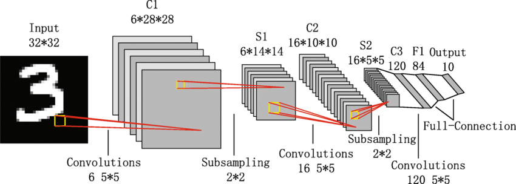

# MNIST Digit Classification using LeNet-5 CNN
## Group 3
## 1. Theoretical Basis

### Convolutional Neural Networks and LeNet-5 Architecture

The system implements the LeNet-5 convolutional neural network architecture for handwritten digit classification. At its core is the convolution operation, which is fundamental to how CNNs process image data.

#### Understanding Convolution

Convolution is a mathematical operation that combines two functions to produce a third function. In the context of image processing and CNNs:

1. **Basic Operation**: A kernel (small matrix) slides over the input image performing element-wise multiplication and summation to produce the output feature map.

2. **Mathematical Expression**:   ```
   (f * g)[n] = Σ f[m]g[n-m]   ```
   Where f is the input image and g is the kernel.

3. **Key Properties**:
   - **Local Connectivity**: Each neuron connects to only a small region of the input
   - **Parameter Sharing**: The same kernel weights are used across different positions
   - **Translation Invariance**: Features can be detected regardless of their position

### LeNet-5 Architecture Details

The implemented network follows the classic LeNet-5 architecture with the following layers:



1. **Input Layer**:
   - Accepts 28x28 grayscale images
   - Normalizes pixel values to improve training stability
   - Input shape: [1, 28, 28]

2. **First Convolutional Layer (Conv1)**:
   - 6 feature maps with 5x5 kernels
   - Extracts basic features like edges and curves
   - Output shape: [6, 24, 24]
   - Uses Tanh activation for non-linearity

3. **First Average Pooling (AvgPool1)**:
   - 2x2 pooling window
   - Reduces spatial dimensions while maintaining feature information
   - Provides translation invariance
   - Output shape: [6, 12, 12]

4. **Second Convolutional Layer (Conv2)**:
   - 16 feature maps with 5x5 kernels
   - Detects more complex patterns by combining basic features
   - Output shape: [16, 8, 8]
   - Uses Tanh activation

5. **Second Average Pooling (AvgPool2)**:
   - 2x2 pooling window
   - Further dimension reduction
   - Output shape: [16, 4, 4]

6. **Fully Connected Layers**:
   - FC1: 16*4*4 → 120 neurons
   - FC2: 120 → 84 neurons
   - FC3: 84 → 10 neurons (output layer)
   - Each FC layer except the last uses Tanh activation


## 2. System Description

### Architecture Overview

The system is implemented as a Python class-based solution with the following components:

1. **MNISTClassifier Class**:
   - Handles data loading and preprocessing
   - Implements model training and evaluation
   - Provides visualization capabilities

2. **LeNet5 Network Class**:
   - Implements the CNN architecture
   - Defines the forward pass logic

### Key Features

- Data augmentation and normalization
- Batch processing for efficient training
- Comprehensive evaluation metrics
- Visualization tools for network analysis
- Confusion matrix generation
- Misclassification analysis

### System Requirements

- Python 3.6+
- PyTorch
- torchvision
- matplotlib
- scikit-learn
- seaborn
- CUDA-capable GPU (optional but recommended)

## 3. Results and Testing

### Training Performance

The network achieved excellent performance on the MNIST dataset:
- Training accuracy: ~99%
- Validation accuracy: ~99%
- Low loss convergence

### Visualization Results

1. **Confusion Matrix Analysis**:
   - Shows strong diagonal pattern indicating good classification
   - Minor confusion between similar digits (e.g., 4-9, 3-8)
   
   *Confusion matrix showing classification performance across all digits*

2. **Layer Activation Visualization**:
   - First layer captures basic edges and strokes
   - Deeper layers show more complex feature detection
   - Final layer demonstrates clear digit discrimination
   
   *Feature maps showing how the network processes a digit through different layers*

3. **Misclassification Analysis**:
   - Most common confusions identified
   - Visual inspection of failure cases
   - Pattern analysis of misclassified digits
   
   *Examples of misclassified digits with their predicted and true labels*

## 4. Conclusions

The implemented LeNet-5 CNN successfully demonstrates:

1. **High Accuracy**: Achieved ~99% accuracy on test set
2. **Robust Feature Learning**: Effective hierarchical feature extraction
3. **Efficient Processing**: Fast training and inference times
4. **Interpretable Results**: Clear visualization of network behavior

### Areas for Improvement

1. Data augmentation could be expanded
2. Architecture modifications for modern hardware
3. Hyperparameter optimization opportunities

## 5. Sources

1. LeCun, Y., et al. (1998). "Gradient-based learning applied to document recognition"
2. PyTorch Documentation: https://pytorch.org/docs/stable/index.html
3. MNIST Database: http://yann.lecun.com/exdb/mnist/
4. Deep Learning Book by Goodfellow, Bengio, and Courville
5. "Understanding Convolutional Neural Networks" by Zeiler and Fergus

